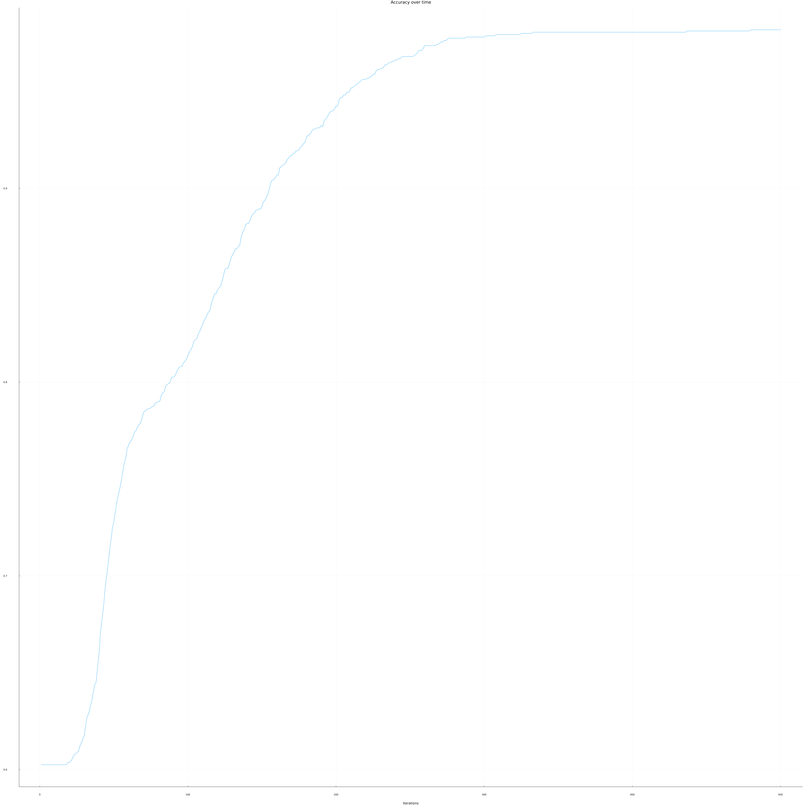

<!-- YoRHa archive -->
```
▸ YoRHa // ARCHIVE — DSLR
```

"Datascience x Logistic Regression": a one-vs-all logistic regression, written from scratch in Julia, that sorts Hogwarts students into their houses from their course grades.

 

| UNIT DATA | |
|---|---|
| Type | 42 Lausanne project · team (2) |
| Stack | Julia · CSV.jl · DataFrames.jl · StatsBase.jl · Plots.jl / StatsPlots.jl |
| Status | ■ COMPLETE |

## ▸ Overview
The data exploration comes first: a hand-written `describe` (count, mean, std, min, quartiles, max, with no stats library) and plots to find which courses separate the houses best.
Classification then trains one logistic model per house (one-vs-all). Missing grades are replaced with the column mean and every feature is min-max normalised. The weights are written to CSV and read back by the predictor.

## ▸ Features
- `describe.jl`: summary statistics computed by hand
- Histogram, scatter plot, pair plot and box plot of every course, by house
- Three training loops in `src/train.jl`: per-weight gradient descent, batch gradient descent (default), stochastic gradient descent, all multi-threaded across the 4 house models
- Optional 75/25 train/validation split to check for overfitting, plus an accuracy-over-iterations plot
- Prediction to `houses.csv` (`Index,Hogwarts House`)

## ▸ Usage
Requires Julia with the packages `CSV`, `DataFrames`, `StatsBase`, `Plots` and `StatsPlots`. Run everything from the repository root (paths are relative).
```bash
# exploration
julia data_visualisation/describe.jl datasets/dataset_train.csv
julia data_visualisation/histogram.jl      # -> plots/histogram.png
julia data_visualisation/scatter_plot.jl   # -> plots/scatter_plots.png
julia data_visualisation/pair_plot.jl      # -> plots/pair_plots.png
julia data_visualisation/box_plot.jl       # -> plots/box_plot.png

# training (weights -> models_output.csv, accuracy curve -> plots/accuracy.png)
julia -t 4 logreg_train.jl datasets/dataset_train.csv

# prediction (-> houses.csv)
julia logreg_predict.jl datasets/dataset_test.csv models_output.csv
```
The hyperparameters (learning rate, iterations, training function, excluded courses, validation split) are set at the top of `logreg_train.jl`.

## ▸ Plots
| Pair plot | Accuracy over iterations |
|---|---|
|  |  |

## ▸ Squad
From the git history (lines added per file):
- **alde-oli** (Alexandre): the three training loops (`src/train.jl`), histogram and box plot, accuracy tracking
- David Vandenbrouck: `describe`, scatter plot, prediction script
- Shared: `logreg_train.jl`, data loading and preprocessing (`src/data.jl`), pair plot

## ▸ Notes
- `logreg_predict.jl` reads `models_output.csv` from the working directory. Its second argument is only checked to exist.
- Test data is normalised with its own min/max, not with the training set's.

---
<sub>▸ Archived by UNIT ALDE-OLI · [profile](https://github.com/alde-oli)</sub>
